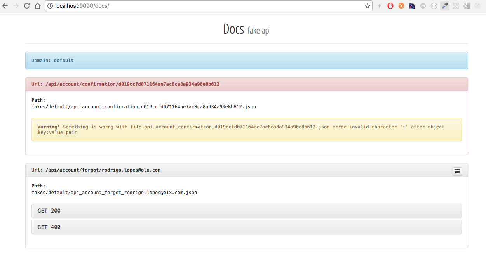
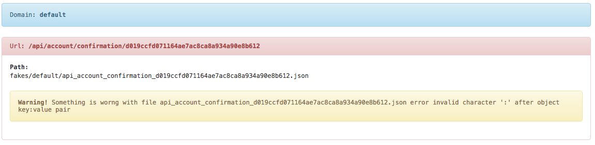
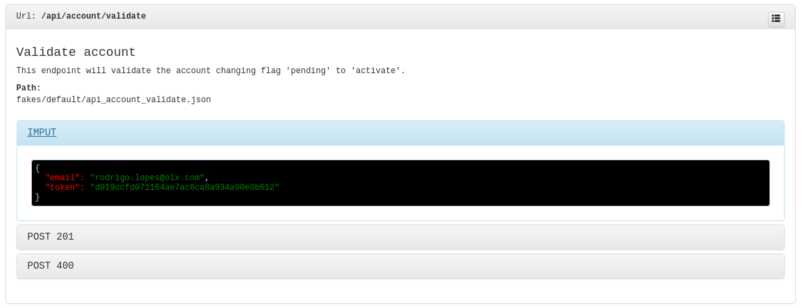

# Fake API

You don't need to wait for backend delivery your api any more, you can simulate the api response with this simple fakeApi, 
you can continue developing your frontend without dependencies.

It is a simple way to mock your api response.

## Source ##

* FakeApi Source
* Version: 1.1.0
* License: ISC


## How to Compile it

 You can see the full available binary list [here](https://gobuild.io/rodkranz/fakeApi)
 or compile those files from different platforms in your owner computer.

## Download

 You can just download and use, without compile anything.


   Download for [Mac OSx](http://tmpcode.com/fake-api/fake-api_darwin_amd64.tar.gz)

   Download for [Linux x386](http://tmpcode.com/fake-api/fake-api_linux_386.tar.gz)

   Download for [Linux amd64](http://tmpcode.com/fake-api/fake-api_linux_amd64.tar.gz)

   Download for [Windows x386](http://tmpcode.com/fake-api/fake-api_windows_386.tar.gz)

   Download for [Windows x64](http://tmpcode.com/fake-api/fake-api_windows_amd64.tar.gz)


## Requirements to Build

 If you want to build in your own computer you need follow this steps below, if you don't want to build you can download at links above.

* [GO Language](https://golang.org/doc/install)

#### Compiling to *Linux*

	$ env GOOS=linux GOARCH=arm GOARM=7 go build -o fakeApi main.go


#### Compiling to *MacOSX*

	$ env GOOS=darwin GOARCH=386 go build -o fakeApi main.go


#### Compiling to *Windows*

	$ env GOOS=windows GOARCH=386 go build -o fakeApi.exe main.go

## Execute ##

Execute `./fakeApi` or `./fakeApi server` to start server.


## Seed File ##
In a folder named `./fakes/default`, you need to have the **seed** (json files) that will represent your api, the server will read all files inside folder and load them.
Use the file name to define the *URL* of api.

**P.S.** All files seed needs to start with `api_[ANYTHING]`.

**e.g.**: If file name is `api_account_signup.json` the url will be `/api/account/signup`.

**The file seed needs to follow this format**: the seed file needs to follow this rules, *method*_*status_code*: *response* (Response can be any format)
```
{
    "[METHOD]_[STATUS_CODE]": [RESPONSE]
}
```

**Example seed format**: 
```
{
	"POST_200": {
        "response": "Post Request with status code 200",
        "statusCode: 200,
	}
}        
```

**Example request**:
```
curl -X POST "http://localhost:9090/api/account/signup"
```

**Response will be**: 
```
{
	"response": "POST Request with status code 200",
	"statusCode: 200,
}
```


## Multiples Response for seed ##

You can add more then one response in seeds file for the same method and different methods too, just follow the rule in seed. 

**E.g**: Seed file name is `api_account_user.json` 
```
{
   "GET_200": {
        "response": "GET Request with status code 200",
        "statusCode: 200,
	},
    "POST_400": {
        "response": "POST Request with status code 400",
        "statusCode: 400,
        "error": {
        	"email": "email has invalid format",
            "time": "the date is invalid"
        }
	}
    "POST_200": {
        "response": "Post Request with status code 200",
        "statusCode: 200,
	}
}
```

**Request POST**: 
when you are using multiple response and no specify the status code in your header request, the response will be random between data that you putting in your seed file.
```
curl -X POST "/api/account/user"
```

**Response POST Dynamic**: 
```
{
	"response": "POST Request with status code 400",
	"statusCode: 400,
	"error": {
		"email": "email has invalid format",
		"time": "the date is invalid"
	}
}
```
or 
```
{
	"response": "Post Request with status code 200",
	"statusCode: 200,
}
```

**Request POST**: use the header `X-Fake-Response-Code` to specify the response that you want to receive.
```
curl -X POST -H "X-Fake-Response-Code: 400" "/api/account/user"
```

**Response POST specific**: 
```
{
	"response": "POST Request with status code 400",
	"statusCode: 400,
	"error": {
		"email": "email has invalid format",
		"time": "the date is invalid"
	}
}
```

## Multiple Domains ##

if you want to use multiples domain you just add a new folder inside of folder `fakes` and use the
header to specific the domain name. 

if you don't want to use the custom domain you can use `default` folder for yours files `seed`.

Folders example: 
```
➜  fakeApi git:(develop) ✗ ls -la fakes
total 0
drwxr-xr-x   3 rlopes  staff   102B 22 Dec 23:34 default/
drwxr-xr-x   8 rlopes  staff   272B 23 Dec 00:11 hecate.com/
drwxr-xr-x   3 rlopes  staff   102B 22 Dec 23:33 olx.com/
```

Request example: 

```
curl -X POST -H "X-Fake-Domain: hecate.com" "http://localhost:9090/api/account/profile"
```

Response must be: 
```
{
  "user": {
    "company": "OLX",
    "country": "PT",
    "email": "rodrigo.lopes@olx.com",
    "id": 1,
    "name": "Rodrigo Lopes",
    "phone": "000000000",
    "phone_region": "PT",
    "username": "rlopes"
  }
}
```

## Delay of response ##

If you want to simulate delay of response you can use the header `X-Fake-Delay` to do that, use the `Millisecond`


Request example: 

```
time curl -X POST -H "X-Fake-Delay: 3000" -H "X-Fake-Domain: hecate.com" "http://localhost:9090/api/account/profile"
```

Response example: 

```
curl ... 0.01s user 0.01s system 0% cpu 3.020 total
```


## List of links available ##

 You can see which links are available at FakeApi `seed` files, access the link `http://localhost:9090/api`
 this link will show list of endpoints available.


#### Json documentation

The docs will be generate automatic 
```
{
    "domain": "default",
    "message": "List of endpoints available for this domain",
    "resource": {
        "Domain": "default",
        "Path": "fakes/default",
        "Docs": [
            {
                "Path": "fakes/default/api_account_confirmation_d019ccfd071164ae7ac8ca8a934a90e8b612.json",
                "Url": "/api/account/confirmation/d019ccfd071164ae7ac8ca8a934a90e8b612",
                "Error": "Something is worng with file api_account_confirmation_d019ccfd071164ae7ac8ca8a934a90e8b612.json error invalid character ':' after object key:value pair",
                "Endpoints": null
            },
            {
                "Path": "fakes/default/api_account_forgot_rodrigo.lopes@olx.com.json",
                "Url": "/api/account/forgot/rodrigo.lopes@olx.com",
                "Error": null,
                "Endpoints": [
                    {
                        "Method": "GET",
                        "StatusCode": 200,
                        "StatusText": "OK",
                        "Data": {
                            "data": {
                                "message": "User password recovery email was sent with success",
                                "success": true
                            }
                        }
                    },
                    ...
                ]
            },
            ...
        ]
    }
}
```

## Web documentation ##

You can use web page friendly if you access [http://localhost:9090/docs](http://localhost:9090/docs).
this page will be generate in realtime the documents that you have in `JSONS` file.

This is an example of page:



When click at title the collapse will open then you can see the response.


If the json has error the docs will render like this



## Seed file for documentation ##

If you want to show more descriptions about your endpoint it is possible if you create a node `DOC` at you `Seed` files
this node needs to have set `title` and `description`, you can see the example above.

 * **DOC**:

    * title: Title with little text about endpoint.
    * description: Text more descriptive about what your endpoint does.
 * **INPUT** :

    * The text saying what your endpoints are expecting to receive from client/frontend, it validate if format of request is equal what was written in seed.
     


*P.S*: Seed file with comments:

```
{
    "DOC": {
        "title": "Validate account",
        "description": "This endpoint will validate the account changing flag 'pending' to 'activate'."
    },
    "INPUT": {
        "email": "rodrigo.lopes@olx.com",
        "token": "d019ccfd071164ae7ac8ca8a934a90e8b612"
    },
    "POST_201": {
        "data": {
            "success": true,
            "message": "OK"
        }
    }
}
```

The web page will be rendered this `seed` above like it:




## Condition Status Code ##
If you want to set condition for your post, 
you need to test if post is correct render response `200` or `400` depends on value of request, 
you can set a additional field `CONDITIONS`
if body of request match with field `DATA` will render the `ACTION` for that.

```
{
    "CONDITIONS": [
        {
            "ACTION": "POST_200",
            "DATA": {
                "username": "rodrigo.lopes@olx.com",
                "password": "correct_password"
            }
        },
        {
            "ACTION": "POST_400",
            "DATA": {
                "username": "rodrigo.lopes@olx.com",
                "password": "wrong_password"
            }
        }
    ],
    "INPUT": {
        "username": "rodrigo.lopes@olx.com",
        "password": "secret_password"
    },
    "POST_200": {
        "message": "Account authentication with success",
        "access_token": "2bc9ef94406489a5181fbd5898aa2202836810f2",
        "success": "true"
    },
    "POST_400": {
        "message": "Failed to authenticate user",
        "success": "false",
        "error": {
            "exception": "Exception: invalid_grant",
            "title": "Invalid username and password combination"
        }
    }
}
```

## Configuring *FakeApi* with *Nginx*.

> I am writing this step ....

---
*P.S*: By default the cross domain is always enabled.
